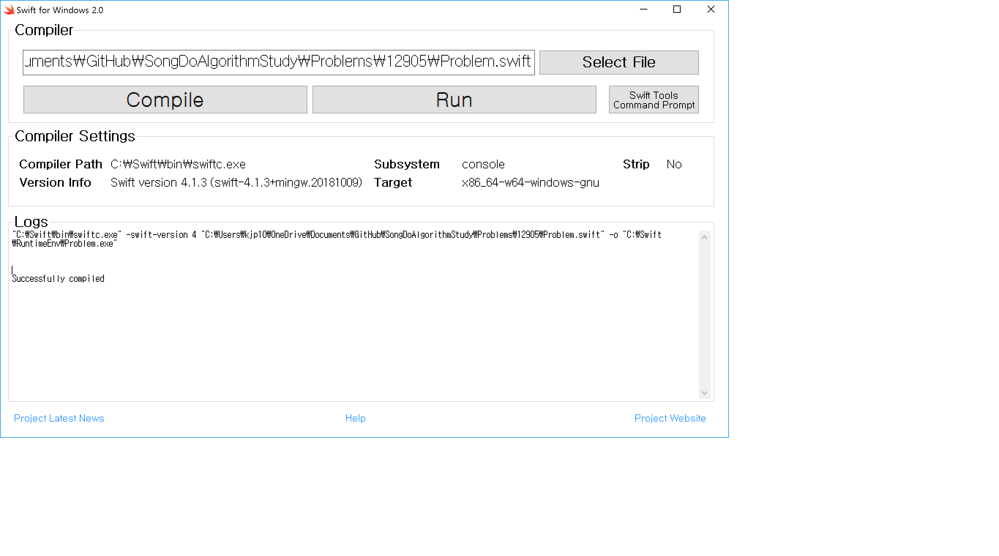

# Problem 12905

## 전화번호 목록

### 문제 설명

1와 0로 채워진 표(board)가 있습니다. 표 1칸은 1 x 1 의 정사각형으로 이루어져 있습니다. 표에서 1로 이루어진 가장 큰 정사각형을 찾아 넓이를 return 하는 solution 함수를 완성해 주세요. (단, 정사각형이란 축에 평행한 정사각형을 말합니다.)

예를 들어

|1|2|3|4|
|-|-|-|-|
|0|1|1|1|
|1|1|1|1|
|1|1|1|1|
|0|0|1|0|

가 있다면 가장 큰 정사각형은

|1|2|3|4|
|-|-|-|-|
|0|**1**|**1**|**1**|
|1|**1**|**1**|**1**|
|1|**1**|**1**|**1**|
|0|0|1|0|

가 되며 넓이는 9가 되므로 9를 반환해 주면 됩니다.

### 제한사항

- 표(board)는 2차원 배열로 주어집니다.
- 표(board)의 행(row)의 크기 : 1000 이하의 자연수
- 표(board)의 열(column)의 크기 : 1000 이하의 자연수
- 표(board)의 값은 1또는 0으로만 이루어져 있습니다.

### 입출력 예

|board|answer|
|--|------|
|[[0,1,1,1],[1,1,1,1],[1,1,1,1],[0,0,1,0]]|9
|[[0,0,1,1],[1,1,1,1]]|4

### 입출력 예 설명

입출력 예 #1\
위의 예시와 같습니다.

입출력 예 #2\
| 0 | 0 | 1 | 1 |\
| 1 | 1 | 1 | 1 |\
로 가장 큰 정사각형의 넓이는 4가 되므로 4를 return합니다.

### 문제 링크

[https://programmers.co.kr/learn/courses/30/lessons/12905?language=swift](hhttps://programmers.co.kr/learn/courses/30/lessons/12905?language=swift)

## System Requirement

- Edit tool: Visual Studio Code
- Compile tool: Swift for Windows 2.0
- Language: Swift

## Test - bash

```bash
cd C:\Swift\bin\
"C:\Swift\bin\swiftc.exe" -swift-version 4 "C:\Users\kjp10\OneDrive\Documents\GitHub\SongDoAlgorithmStudy\Problems\12905\Problem.swift" -o "C:\Swift\RuntimeEnv\Problem.exe"
```

## Test - Swift for Windows 2.0

### Downloads

- [https://swiftforwindows.github.io/](https://swiftforwindows.github.io/)
- Screen shot
- 

### Compile and Run

- Click Compile button
- Click Run button

## Solve - not DP

- 처음엔 DP가 아닌 방법으로 풀어보려고 함
- 즉 board의 row, col의 count를 알 수 있으므로 row와 col별로 1이 연속된 개수 (2 이상) 중 작은 수의 제곱을 하면 될 거라 판단하고 간단하게 짜 보았음.
  - 예를 들어 문제의 예제와 같이 4x4 board인데 row 중에서 에서 1이 연속된 개수 중 작은 건 row[0]에서 3
  - col 역시 1이 연속된 개수 중 작은 건 col[1]과 col[3]에서 3 이므로
  - 둘의 최소값은 3이고 3<sup>2</sup>은 9여서
- 테스트 2개는 가볍게 통과함
- 그런데 채점 했을 때 통과된 case가 3개 뿐이었음
- 이렇게 풀면 안되는구나를 빨리 깨닫고 DP 형태로 다시 품

## Solve - DP

- 가장 큰 정사각형이 만들어지려면, 그것 보다 길이가 1 작은 정사각형이 충족되어야 한다는 점을 생각해 볼 수 있고, 그러면 최소 정사각형인 길이가 2인 것부터 차례대로 체크해 나가면서 확인해 보면 역시 DP 문제라는 걸 알게 됨
- 최소 정사각형은 [row, col]에 해당하는 자기 자신의 값과 [row+1 col], [row, col+1]의 세 값이 0이 아닌 1의 숫자로 이루어졌을 때 판단할 수 있다.
- 그 때 [row+1, col+1]의 값 역시 0이 아닐 때 최소 정사각형이 존재하는 걸 판단할 수 있고
- 그것 보다 더 큰 정사각형, 즉 row+2, col+2가 존재하는지 나중에 판단하기 위해 row+1, col+1 쪽에 1+1인 2의 값을 세팅해 놓는다.
- 그렇게 loop를 돌다 보면 [row, col], [row+1, col], [row, col+1]이 2가 되는 시점도 존재할 수 있다. 그러면 [row+1, col+1]에 2+1의 값인 3을 세팅해 놓는다.
- 이렇게 loop를 다 돌게 되면 [row+n, col+n]에 해당하는 값 중에 가장 큰 값을 세팅해 놓은 숫자가 가장 큰 정사각형의 한 변의 길이가 된다.
- 결과값은 정사각형의 넓이인 한 변의 길이의 제곱을 리턴하면 된다.

### loop 조건

- loop는 row+1, col+1에 해당하는 값을 체크하므로 row.count - 1, col.count - 1 만큼만 돌아준다.
- 만약 count == 1인 경우는 for loop가 돌지 않으므로 row.count == 1이거나 col.count == 1인 경우 값이 최소한 1로 채워진 row,col이 있다면 정사각형의 넓이 1이 있다고 체크해 줘야 한다.