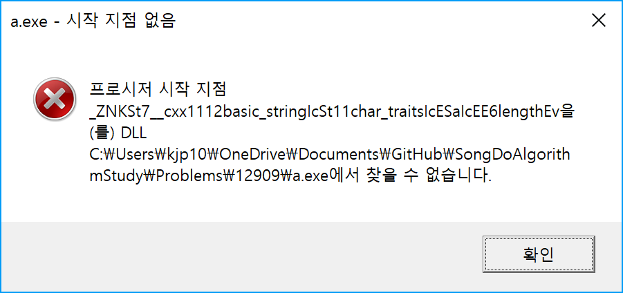

# Problem 12909

## 올바른 괄호

### 문제 설명

올바른 괄호란 두 개의 괄호 '(' 와 ')' 만으로 구성되어 있고, 괄호가 올바르게 짝지어진 문자열입니다. 괄호가 올바르게 짝지어졌다는 것은 '(' 문자로 열렸으면 반드시 짝지어서 ')' 문자로 닫혀야 합니다.
예를들어

- ()() 또는 (())() 는 올바른 괄호입니다.
- )()( 또는 (()( 는 올바르지 않은 괄호입니다.

'(' 또는 ')' 로만 이루어진 문자열 s가 주어졌을 때, 문자열 s가 올바른 괄호이면 true를 return 하고, 올바르지 않은 괄호이면 false를 return하는 solution 함수를 완성해 주세요.

### 제한사항

- 문자열 s의 길이 : 100,000 이하의 자연수
- 문자열 s는 '(' 또는 ')' 로만 이루어져 있습니다.

### 입출력 예

|s|answer|
|-|------|
|"()()"|true|
|"(())()"|true|
|")()("|false|
|"(()("|false|

### 입출력 예 설명

입출력 예 #1,2,3,4
문제의 예시와 같습니다.

### 문제 링크

[https://programmers.co.kr/learn/courses/30/lessons/12909?language=cpp](https://programmers.co.kr/learn/courses/30/lessons/12909?language=cpp)

## System Requirement

- Tool: Visual Studio Code
- Language: C++
- Compiler: g++.exe (MinGW.org GCC-6.3.0-1) 6.3.0
- Use MinGW

## MinGW Download (only windows)

- [https://sourceforge.net/projects/mingw/files/](https://sourceforge.net/projects/mingw/files/)

## Test - bash

Change directory git root: /12909
and compile

```bash
g++ -static Problem.cpp
```

[with debugging](https://gcc.gnu.org/onlinedocs/gcc/Debugging-Options.html#Debugging-Options)

```bash
g++ -static -g Problem.cpp
```

> Windows Environment Settings
> System Variable > Path > Add "C:\MinGW\bin" (Installed path)

Run

```bash
a
```

## Test - Visaul Studio Code

- Open folder "12909" by Visual Studio Code
- Check out settings: launch.json and tasks.json
  - launch.json
    - "miDebuggerPath": "C:/mingw/bin/gdb.exe"
    - Use MinGW installed your path
  - tasks.json
    - Use gdb debug: args[0] = "-g"
- Press F5 to debug start

## Solve

- 아주 쉽게 string의 각 index 별로 loop를 돌면서 "(" 이면 +1, ")"이면 -1로 계산하면 checkPair 값이 최종적으로 0이 됐을 때가 괄호 쌍이 맞으므로 true 아니면 false를 return
- 그런데 테스트 3번의 경우가 실패
  - 잘 보면 +2, -2로 0이 되긴 하는데 열고 닫는 쌍으로는 맞지 않아 true로 계산이 되므로
  - 괄호가 마이너스(-)가 되는 순간은 괄호 쌍이 안맞아 그냥 false를 return 하는게 맞겠다 싶어 추가 수정
- 그리고 채점해 보면 효율성 테스트 까지 통과함

## g++ complile

- 사실 c 컴파일은 gcc로 하면 잘 되는데 c++ 컴파일러인 g++은 처음 써본다.
- 그런데 MinGW 설치 시 g++ 설치한 후 g++ 실행하면 잘 되고, 심지어 hello world 찍는 코드도 잘 컴파일 되고 잘 실행 된다.
- 문제는, include string을 하면서 부터인데 이걸 하면 뭘 하든 다음과 같은 에러 창을 만나게 되어 있다.
- 
- 그래서 라이브러리 링크 문제라고 생각해 검색해 봤는데 컴파일 옵션에 -static을 붙여줘야 static link를 해준다는 걸 알았다. 그리고 아래의 링크에서 문제점을 해결하였다.
- [https://www.reddit.com/r/cpp_questions/comments/6fply1/compiling_technical_issue/](https://www.reddit.com/r/cpp_questions/comments/6fply1/compiling_technical_issue/)

## Useful option

- c++은 base가 c여서 bool의 값을 출력하면 0 아니면 1로 출력이 된다.
- 이걸 true, false로 출력하려면 if 문 걸고 "true", "false"와 같은 string 변수를 사용하는 방법도 있지만
- std::boolalpha를 걸어 준 후에 bool 변수를 출력해 보면 true, false라는 string을 아름답게 출력해 주는 걸 확인할 수 있다.
- boolalpha는 bool을 str stream으로 출력해 주는 flag의 기능을 가지고 있다고 한다.
- [http://www.cplusplus.com/reference/ios/boolalpha/](http://www.cplusplus.com/reference/ios/boolalpha/)