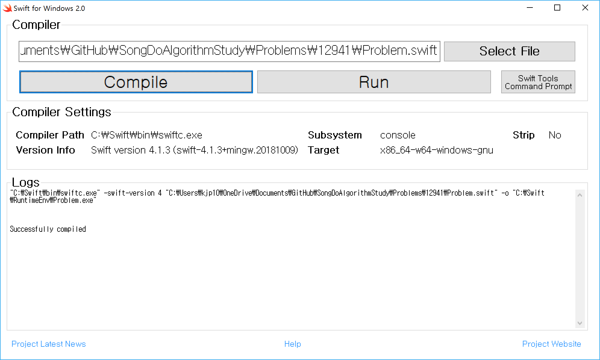

# Problem 12941

## 최솟값 만들기

### 문제 설명

길이가 같은 배열 A, B 두개가 있습니다. 각 배열은 자연수로 이루어져 있습니다. 
배열 A, B에서 각각 한 개의 숫자를 뽑아 두 수를 곱합니다. 이러한 과정을 배열의 길이만큼 반복하며, 두 수를 곱한 값을 누적하여 더합니다. 이때 최종적으로 누적된 값이 최소가 되도록 만드는 것이 목표입니다. (단, 각 배열에서 k번째 숫자를 뽑았다면 다음에 k번째 숫자는 다시 뽑을 수 없습니다.)

예를 들어 A = [1, 4, 2] , B = [5, 4, 4] 라면

- A에서 첫번째 숫자인 1, B에서 두번째 숫자인 5를 뽑아 곱하여 더합니다. (누적된 값 : 0 + 5(1x5) = 5)
- A에서 두번째 숫자인 4, B에서 세번째 숫자인 4를 뽑아 곱하여 더합니다. (누적된 값 : 5 + 16(4x4) = 21)
- A에서 세번째 숫자인 2, B에서 첫번째 숫자인 4를 뽑아 곱하여 더합니다. (누적된 값 : 21 + 8(2x4) = 29)

즉, 이 경우가 최소가 되므로 29를 return 합니다.

배열 A, B가 주어질 때 최종적으로 누적된 최솟값을 return 하는 solution 함수를 완성해 주세요.

### 제한사항

- 배열 A, B의 크기 : 1000 이하의 자연수
- 배열 A, B의 원소의 크기 : 1000 이하의 자연수

### 입출력 예

|A|B|answer|
|-|-|------|
|[1,4,2]|[5,4,4]|29|
|[1,2]|[3,4]|10|

### 입출력 예 설명

입출력 예 #1\
문제의 예시와 같습니다.

입출력 예 #2\
A에서 첫번째 숫자인 1, B에서 두번째 숫자인 4를 뽑아 곱하여 더합니다. (누적된 값 : 4) 다음, A에서 두번째 숫자인 2, B에서 첫번째 숫자인 3을 뽑아 곱하여 더합니다. (누적된 값 : 4 + 6 = 10)
이 경우가 최소이므로 10을 return 합니다.

### 문제 링크

[https://programmers.co.kr/learn/courses/30/lessons/12941?language=swift](hhttps://programmers.co.kr/learn/courses/30/lessons/12941?language=swift)

## System Requirement

- Edit tool: Visual Studio Code
- Compile tool: Swift for Windows 2.0
- Language: Swift

## Test - bash

```bash
cd C:\Swift\bin\
"C:\Swift\bin\swiftc.exe" -swift-version 4 "C:\Users\kjp10\OneDrive\Documents\GitHub\SongDoAlgorithmStudy\Problems\12941\Problem.swift" -o "C:\Swift\RuntimeEnv\Problem.exe"
```

## Test - Swift for Windows 2.0

### Downloads

- [https://swiftforwindows.github.io/](https://swiftforwindows.github.io/)
- Screen shot
- 

### Compile and Run

- Click Compile button
- Click Run button

## Solve

- 두 배열에서 각 index의 값을 곱할 떄 최소값 구하기 문제
- A는 accending order, B는 decending order로 sort 하고 서로 곱하면 최소값 아닐까? 해서 해보니 됨

## Swift experirence

- Array sort의 경우 accending, decending이 '<', '>'로 간단하게 되어 있다. accending의 경우는 by: 호출 없이 그냥 sort() 호출로도 가능하다.

``` Swift
var arr = [1, 4, 3]
arr.sort() // 1, 3, 4
arr.sort(by: >) // 4, 3, 1
```

- '>' 기호의 의미는 함축적이다. 보통 c++의 sort 함수를 직접 구현하거나 기타 언어에서 compare interface를 구현하게 될 때 -1 값 즉 왼쪽 값이 클 경우에는 decending sort를 할 수 있다는 점에서 '>' 기호는 특별한 것 같다.

## python의 zip을 따라한 듯 한 swift의 zip

- python에서도 zip을 사용하면 enumerate 가능한 변수들을 한꺼번에 묶고 그걸 한번에 iterating할 수 있는데 swift에도 그 기능이 있다.

- 문법도 똑같다. zip으로 묶은 갯수 만큼 for loop에서 나열한 item이 순서대로 들어온다는 점에서 매우 편하다.